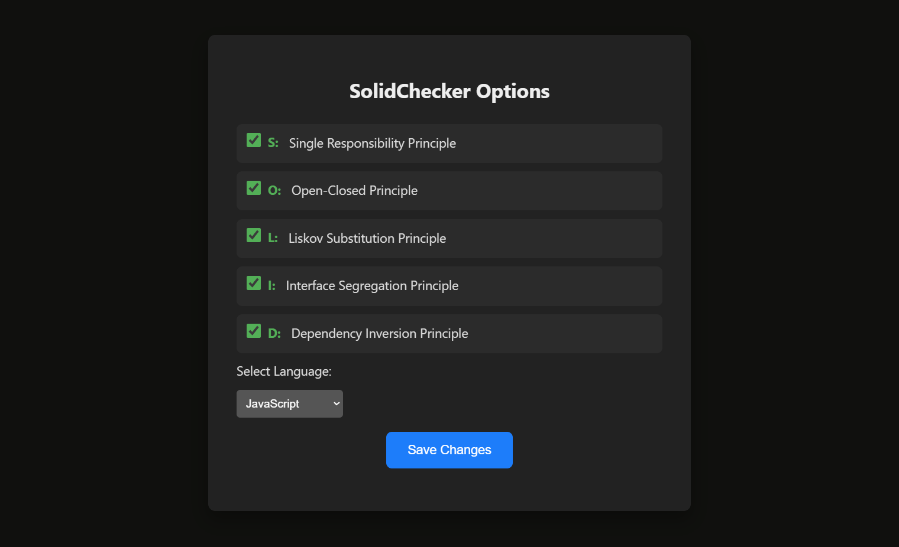
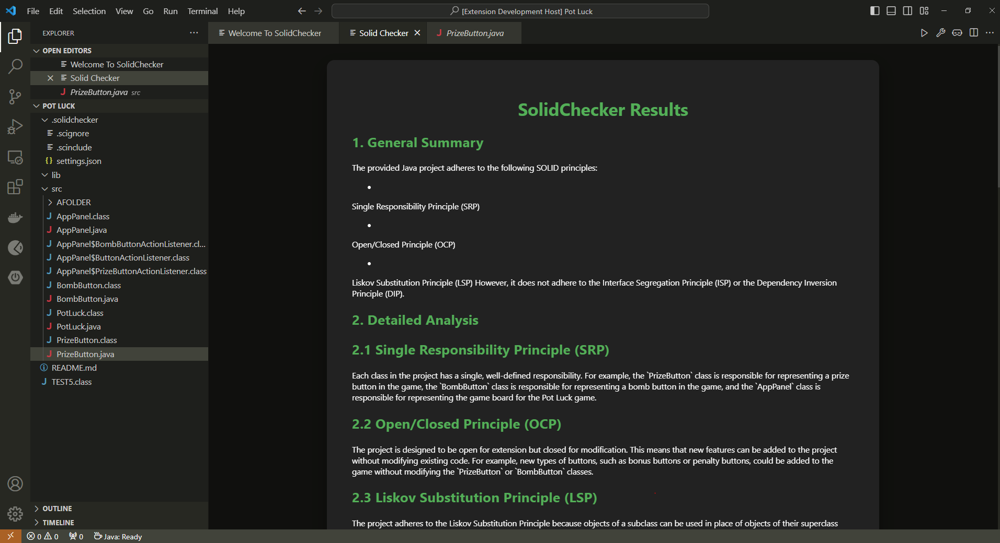
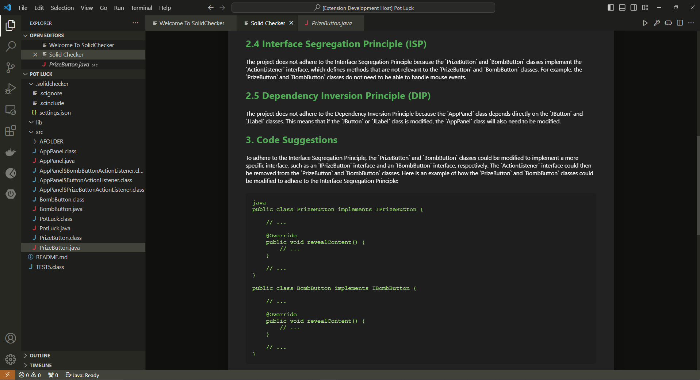
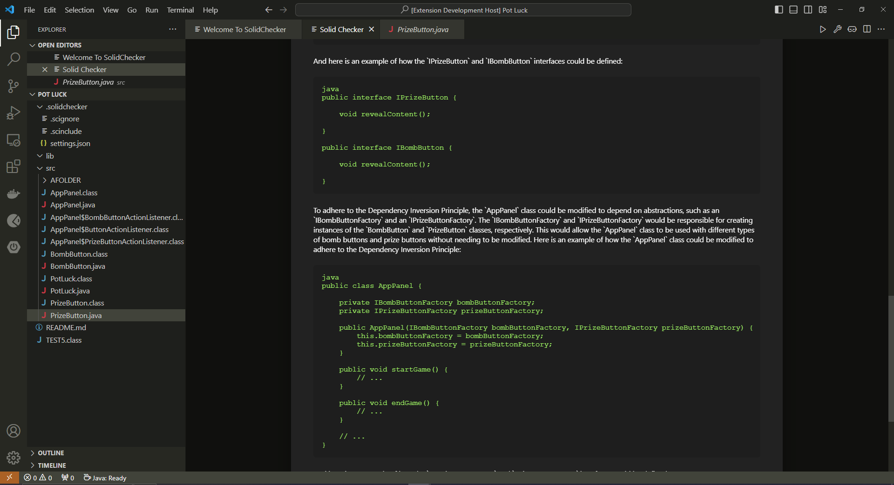

# SolidChecker
A VSCode extention that enables you to write code by obeying SOLID principles.

## How to run
To run the extension, follow these steps:
* Clone the repo, open it with **VSCode**
* Navigate to the `SolidChecker/solidchecker` folder,
* Run `npm install` to install the dependencies,
* Then, navigate to `src/extention.ts` and hit **F5**.
* You will be opening a Debug VSCode with our extention being activated.

## How to use
There are two main commands use can run using the Command Palette (<kbd>control</kbd> + <kbd>shift</kbd> + <kbd>p</kbd>):
* **Run: Solid Checker** and,
* **Config: SolidChecker**

### Config: SolidChecker command
This command will open the following panel:

This is the configuration panel for SolidChecker. Here, the user can change how the extention behaves. The two options are changing for which of the SOLID principles will analyzed and for which language the extention will be run for.

### Run: SolidChecker command
This command will start the analysis and when the analysis is done, this screen will pop-up:

